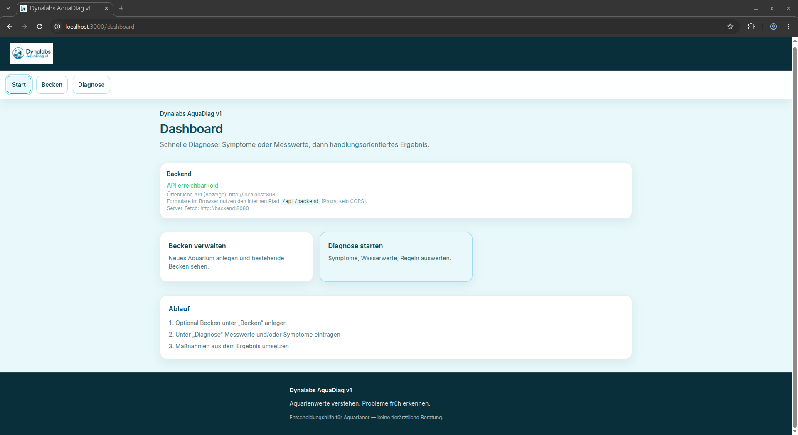
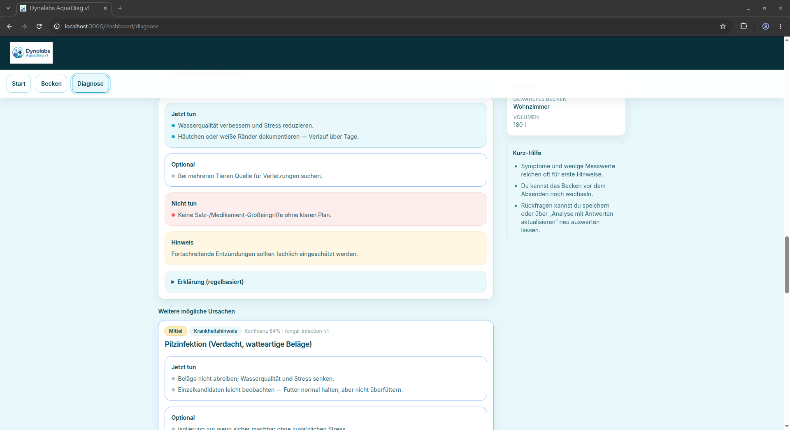
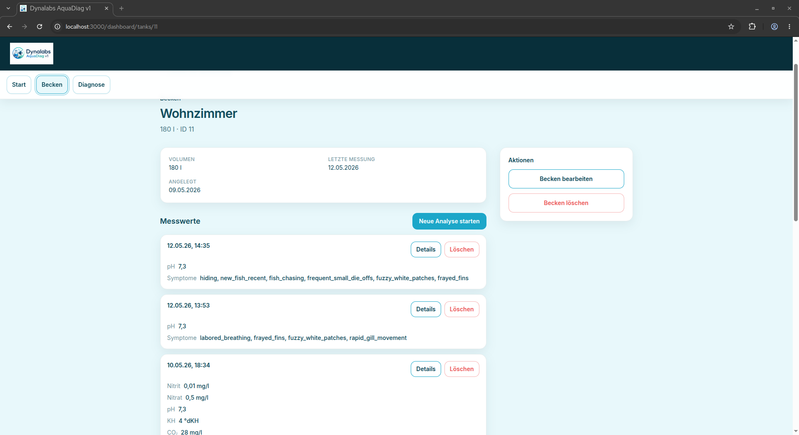

<div align="center">


# Dynalabs AquaDiag

**Aquarienwerte verstehen. Probleme früh erkennen.**

Eine minimalistische, deterministische Entscheidungshilfe für Aquariumprobleme.
Symptome (und optional Wasserwerte) erfassen → in Sekunden eine erklärbare
Diagnose mit klaren nächsten Schritten erhalten.

[](https://github.com/sldna/dynalabs-aquadiag/actions/workflows/ci.yml)
[](LICENSE)
[](CHANGELOG.md)
[](backend/go.mod)
[](frontend/package.json)
[](docker-compose.yml)
[](docs/architecture.md)
[](rules/aquarium-rules.yaml)

</div>

---

> [!IMPORTANT]
> AquaDiag ist **keine tierärztliche Beratung** und kein Ersatz für
> Fachpersonal. Empfehlungen stützen sich auf deine Eingaben und die
> deterministische YAML-Regelengine. Bei akuten Symptomen bitte fachkundig
> beraten lassen.

## Inhaltsverzeichnis

- [Features](#features)
- [Tech Stack](#tech-stack)
- [Screenshots](#screenshots)
- [Quick Start](#quick-start)
- [Local Development](#local-development)
- [AI Configuration](#ai-configuration)
- [Project Structure](#project-structure)
- [Configuration Reference](#configuration-reference)
- [API Overview](#api-overview)
- [Ampelsystem für Wasserwerte (M3.5)](#ampelsystem-für-wasserwerte-m35)
- [Severity-Werte](#severity-werte)
- [Roadmap](#roadmap)
- [Contributing](#contributing)
- [License](#license)

## Features

- **Deterministische Diagnose** über eine versionierte YAML-Regelbasis – kein
  Black-Box-Modell, vollständig nachvollziehbar, mit Score-Breakdown pro Regel
- **Optionaler AI-Explainability-Layer**: AI erklärt das Ergebnis in
  freundlichem Deutsch, ohne jemals die Diagnose zu überstimmen
- **Tank-Management**: mehrere Aquarien, Notizen, sauberer Lösch-Workflow ohne
  verwaiste Datensätze
- **Wassertest-Historie** pro Becken (neueste zuerst), inklusive Symptome und
  Diagnoseverknüpfung
- **Ampelsystem für Wasserwerte** (M3.5): jede Messung erhält zusätzlich eine
  einfache Grün/Gelb/Rot-Einschätzung pro Wert und für die Messung gesamt –
  als Orientierung, ohne die deterministische Diagnose zu verändern
- **Landing & Branding**: Startseite (`/`) mit Hero, Nutzenkarten, Ablauf und
  Vertrauens-/Sicherheitshinweisen; Header mit Logo und Schriftzug
  „Dynalabs AquaDiag“; CTAs zur Analyse und Beckenübersicht
- **Mobile-first UI** im Aqua-CD-Stil (Tailwind + Inter), Actions-first
- **Lokales SQLite** als Standard – kein DB-Server nötig
- **Docker-Compose-Setup** für Backend, Frontend und persistente Daten
- **Strukturierte JSON-Fehler & -Logs** (`log/slog`), Container-Healthcheck
  inklusive

## Tech Stack

| Schicht       | Wahl                              | Warum                                  |
|---------------|-----------------------------------|----------------------------------------|
| Backend       | **Go 1.25**, `net/http`, `log/slog` | klein, schnell, statisch gelinkt       |
| Persistenz    | **SQLite** (`modernc.org/sqlite`) | keine externe DB nötig, CGO-frei       |
| Regel-Engine  | **YAML** + eigener Validator/Scorer | nachvollziehbar und versionierbar      |
| Frontend      | **Next.js 15** (App Router), React 19, TypeScript | mobile-first, RSC, Streaming           |
| Styles        | **Tailwind CSS** + AquaDiag-CD-Tokens | konsistent, kein eigener Designcode    |
| Orchestrierung| **Docker Compose** (Podman kompatibel) | „funktioniert auf jedem Laptop“        |
| AI (optional) | OpenAI-kompatibler Endpoint       | austauschbar, off-by-default           |

## Screenshots

> Bilder unter `docs/screenshots/` ablegen. Die README erwartet folgende Dateien:

| Bereich            | Datei                              |
|--------------------|------------------------------------|
| Dashboard          | `docs/screenshots/dashboard.png`   |
| Diagnose-Ergebnis  | `docs/screenshots/diagnosis.png`   |
| Tank-Detail        | `docs/screenshots/tank-detail.png` |






## Quick Start

Du brauchst **Docker** (oder Podman) mit dem Compose-Plugin. Sonst nichts.

```bash
git clone https://github.com/sldna/dynalabs-aquadiag.git
cd dynalabs-aquadiag
cp .env.example .env
docker compose up --build
```

Danach erreichbar:

| Dienst        | URL                                  |
|---------------|--------------------------------------|
| Frontend      | http://localhost:3000 (Landingpage; App unter `/dashboard`) |
| Backend Health| http://localhost:8080/health         |
| API-Beispiel  | siehe [`docs/api.md`](docs/api.md)   |

Alternativ über das Makefile:

```bash
make up        # Stack bauen und starten
make logs      # Live-Logs
make down      # Stack stoppen
make help      # alle Targets anzeigen
```

> [!NOTE]
> Podman-Nutzer:innen können `docker compose` durch `podman compose` bzw.
> `podman-compose` ersetzen. Bei „container state improper“ hilft
> `podman-compose down && podman-compose up --build --force-recreate`.

## Local Development

### Backend (Go ≥ 1.25)

```bash
cd backend
go run ./cmd/api          # API auf :8080
go test ./...             # Tests
gofmt -w cmd internal     # Formatieren
```

Per Makefile:

```bash
make backend-run
make backend-test
make backend-fmt
make backend-fmt-check
make backend-vet
```

### Frontend (Node.js ≥ 22)

```bash
cd frontend
npm install
npm run dev               # Next.js Dev-Server auf :3000
npm run lint              # ESLint
npm test                  # Vitest
npm run build             # Produktions-Build
```

Per Makefile:

```bash
make frontend-install
make frontend-dev
make frontend-lint
make frontend-test
make frontend-build
```

### Lokales „CI light“

```bash
make ci       # lint + tests (Backend & Frontend) + compose config check
```

## AI Configuration

> [!TIP]
> AquaDiag ist **vollständig benutzbar ohne AI**. Der AI-Layer ist eine
> optionale Erklärungsschicht und niemals Quelle der Diagnose.

| Modus                  | Verhalten                                                              |
|------------------------|-------------------------------------------------------------------------|
| `AI_ENABLED=false` (Default) | API liefert ausschließlich die deterministischen Regeltexte; `ai_explanation=null`; `meta.ai_status="disabled"` |
| `AI_ENABLED=true`      | Bei Erfolg: `ai_explanation` enthält die nutzerfreundliche Erklärung; `meta.ai_status="ok"` |
| AI-Fehler / Timeout    | Diagnose bleibt gültig; `ai_explanation=null`; `meta.ai_status="failed"` |

Was die AI **darf**: in einfaches Deutsch übersetzen, Ursache zusammenfassen,
Rückfragen formulieren, Unsicherheit erklären.

Was die AI **nicht darf**: eine andere Diagnose vorschlagen, `severity` /
`confidence` ändern, zusätzliche Aktionen oder Medikamente vorschlagen, absolute
Sicherheit suggerieren.

Variablen (siehe `.env.example`): `AI_ENABLED`, `AI_API_KEY`, `AI_BASE_URL`
(vollständige Chat-Completions-URL, OpenAI-kompatibel), `AI_MODEL`,
`AI_TIMEOUT_SECONDS`.

## Project Structure

```text
.
├── backend/                Go API (HTTP, Regel-Engine, SQLite, AI-Adapter)
│   ├── cmd/api/            Server-Einstieg
│   └── internal/           api, db, rules, diagnosis, ai, models
├── frontend/               Next.js App Router + Tailwind
│   ├── src/app/            Root-Landing (`page.tsx`), Dashboard, Tanks, Diagnose
│   ├── src/components/     UI-Bausteine inkl. Severity-Mapping
│   └── public/logos/       Markenassets
├── rules/                  YAML-Regelbasis (`aquarium-rules.yaml`)
├── docs/                   Architektur, API, Screenshots
├── .github/                CI, Issue-/PR-Templates, Labels
├── docker-compose.yml      Standard-Orchestrierung
├── Makefile                Dev-Convenience-Targets
└── .env.example            Beispielkonfiguration
```

Tiefer einsteigen:
[`docs/architecture.md`](docs/architecture.md) ·
[`docs/api.md`](docs/api.md)

## Configuration Reference

Die wichtigsten Variablen aus `.env.example`:

| Variable                    | Default                    | Zweck                                       |
|-----------------------------|----------------------------|---------------------------------------------|
| `APP_ENV`                   | `development`              | `production` versteckt Debug-Metadaten       |
| `BACKEND_PORT`              | `8080`                     | API-Port                                    |
| `FRONTEND_PORT`             | `3000`                     | Web-UI-Port                                 |
| `DATABASE_PATH`             | `/data/aquadiag.db`        | SQLite-Pfad (Container ⇒ Volume)            |
| `RULES_PATH`                | autom. erkannt             | optionaler Pfad zur YAML-Regelbasis          |
| `CORS_ALLOWED_ORIGINS`      | Localhost-Ports            | erlaubte Browser-Origins                    |
| `NEXT_PUBLIC_API_BASE_URL`  | `http://localhost:8080`    | Browser-Sicht auf die API                    |
| `API_INTERNAL_BASE_URL`     | `http://backend:8080`      | Server-Sicht des Frontends auf die API       |
| `AI_ENABLED`                | `false`                    | AI-Erklärungsschicht an/aus                  |
| `AI_API_KEY` / `AI_BASE_URL` / `AI_MODEL` | leer        | nur nötig wenn AI aktiv                      |
| `AI_TIMEOUT_SECONDS`        | `8`                        | hartes Timeout für AI-Aufrufe                 |

> [!CAUTION]
> Niemals echte API-Keys committen. `.env` ist in `.gitignore`. Beispielwerte
> ausschließlich in `.env.example`.

## API Overview

Die vollständige API-Referenz mit Beispiel-Bodies und Antwort-Schemata steht in
[`docs/api.md`](docs/api.md). Übersicht:

| Verb     | Route                                  | Zweck                                                |
|----------|----------------------------------------|------------------------------------------------------|
| GET      | `/health`                              | Backend-Health                                       |
| GET      | `/v1/tanks`                            | Liste aller Becken (mit Summary)                     |
| POST     | `/v1/tanks`                            | Becken anlegen                                       |
| GET      | `/v1/tanks/{id}`                       | Becken-Details                                       |
| PUT      | `/v1/tanks/{id}`                       | Becken partiell aktualisieren                        |
| DELETE   | `/v1/tanks/{id}`                       | Becken + abhängige Daten löschen                     |
| GET      | `/v1/tanks/{id}/water-tests`           | Wassertests eines Beckens (neueste zuerst)           |
| GET      | `/v1/water-tests/{id}`                 | einzelner Wassertest inkl. Symptome                  |
| DELETE   | `/v1/water-tests/{id}`                 | Wassertest + abhängige Diagnosen löschen             |
| POST     | `/v1/diagnose`                         | Diagnose erzeugen (Symptome + optionale Wasserwerte) |
| PATCH    | `/v1/diagnoses/{id}`                   | Antworten auf Rückfragen speichern                   |

Schnelles Beispiel:

```bash
curl -sS -X POST "http://localhost:8080/v1/diagnose" \
  -H "Content-Type: application/json" \
  -d '{
    "tank": { "name": "Wohnzimmer", "volume_liters": 180 },
    "water": { "nitrite_mg_l": 0.4 },
    "symptoms": []
  }' | jq '{ status, top_rule: .top_diagnosis.rule_id, meta }'
```

## Ampelsystem für Wasserwerte (M3.5)

Jeder Wassertest erhält zusätzlich zur Diagnose eine einfache Ampel-Bewertung
pro Messwert und für die Messung gesamt. Die Bewertung erscheint in den
Response-Feldern `water_quality_status` und `water_quality_items[]` (siehe
[`docs/api.md`](docs/api.md)) und wird in der UI als kompaktes Badge sowie
als zusammenfassende Karte dargestellt.

| Status     | Bedeutung                                           | UI-Tonalität |
|------------|-----------------------------------------------------|--------------|
| `green`    | Unauffällig im konservativen Anfängerbereich        | Erfolg/Grün  |
| `yellow`   | Beobachten – außerhalb des Optimalbereichs          | Hinweis/Gelb |
| `red`      | Kritisch – zeitnah eingreifen                       | Kritisch/Rot |
| `unknown`  | Nicht bewertet (z. B. wenn keine Werte gemessen wurden) | Neutral      |

Grundregeln der Heuristik:

- **NO₂** ist die strengste Größe: Werte *an oder unterhalb* der Nachweisgrenze
  hobbyüblicher Tropfentests (≤ 0,01 mg/l, typisch als „<0,01 mg/l“ ablesbar)
  bleiben `green`. Jeder klar darüber liegende Messwert (z. B. der nächste
  Skalenschritt 0,025 mg/l) ist mindestens `yellow`, deutliche Erhöhung
  (≥ 0,25 mg/l) ist `red`.
- **NH₃/NH₄⁺** wird konservativ bewertet (ohne pH/Temperatur-Korrektur).
- **Temperatur, pH, KH, GH** verwenden absichtlich breite, anfängerfreundliche
  Bänder, um Fehlalarme zu vermeiden.

> [!IMPORTANT]
> Das Ampelsystem ist eine **Orientierung anhand der Messwerte** – kein
> Ersatz für tierärztliche Diagnostik. Die Diagnoseentscheidung der
> deterministischen Regel-Engine bleibt davon unberührt.

Quelle der Wahrheit für die Grenzwerte:
[`backend/internal/waterquality/evaluator.go`](backend/internal/waterquality/evaluator.go).

## Severity-Werte

Identisch über Backend, API und Frontend:

| Severity   | Bedeutung                            | UI                |
|------------|---------------------------------------|-------------------|
| `info`     | Hinweis, kein direkter Handlungsdruck | Info              |
| `low`      | Geringe Auffälligkeit, beobachten     | Erfolg            |
| `medium`   | Spürbares Problem, zeitnah handeln  | Hinweis           |
| `high`     | Deutliches Risiko, schnell handeln    | Warnung           |
| `critical` | Akute Gefahr, sofort handeln          | Kritisch          |

Quellen: `backend/internal/rules/severity.go`,
`frontend/src/lib/severity.ts`, [`docs/api.md`](docs/api.md).

## Roadmap

AquaDiag bleibt bewusst klein. Geplante Etappen:

- [x] **MVP**: Tank-Management, Diagnose, YAML-Regelbasis, AI optional
- [x] **M3**: Erklärbarkeit & Scoring der Regel-Engine
- [x] **M3.5**: Ampelsystem für Wasserwerte (Orientierungsschicht, keine Diagnoseänderung)
- [ ] **M4**: Open-Source-Launch (diese Phase) – Doku, DX, CI, Templates
- [ ] **AI Improvements**: bessere Erklärungen, mehrsprachig
- [ ] **Better Rules**: erweiterte Regelpakete in `rules/v1/`
- [ ] **Sensor Integration (später, optional)**: ESP32/Shelly als externer Adapter
- [ ] **PostgreSQL (später, optional)**: hinter Repository-Interface, ohne Pflicht

Bewusst **nicht** geplant: Auth, Payments, Kubernetes, Foto-Analyse,
Community-Features, mobile native App.

## Contributing

Beiträge sind sehr willkommen. Bitte vor dem ersten PR lesen:

- [`CONTRIBUTING.md`](CONTRIBUTING.md) – Branch-Workflow, Commits, AI-Guardrails
- [`CODE_OF_CONDUCT.md`](CODE_OF_CONDUCT.md) – Contributor Covenant
- [`SECURITY.md`](SECURITY.md) – verantwortungsvolle Offenlegung

Kurz:

1. Branch von `main` ziehen (`feature/...`, `fix/...`, `refactor/...`).
2. `make lint && make test` muss grün sein.
3. PR mit ausgefülltem Template eröffnen.

## License

AquaDiag ist **source available** unter der
**PolyForm Noncommercial License 1.0.0** (siehe [`LICENSE`](LICENSE) und
[`NOTICE`](NOTICE)).

Nicht-kommerzielle Nutzung ist gemäß den Lizenzbedingungen erlaubt; kommerzielle
Nutzung – inklusive Hosting als kommerzielles SaaS-Angebot – erfordert eine
separate kommerzielle Lizenz. Beiträge werden, sofern nicht ausdrücklich anders
vereinbart, unter denselben Bedingungen aufgenommen.
